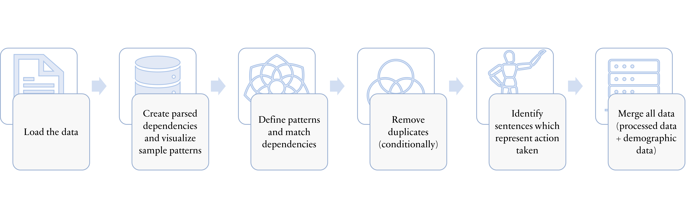

# What made you happy? An analysis of common actions linked to happy moments 
### This project was completed as a part of the Applied Data Science course @ Columbia University.


> *"Happiness is not something ready-made. It comes from your own actions"* - Dalai Lama


There is no dearth of research on happiness. Several researchers have attempted to theorize or emperically investigate measure of happiness, what happy people do, phisolosophy of happiness and factors related to joy - to name a few. This project aims to add to that field by using crowd-sourced collection of 100,000 happy moments ('HappyDB' database) to extract actions performed by individuals (self-reported) that made them happy in the past 24 hours or 3 months. 

The aim of the project is not to predict what actions lead to happiness - that level of inference requires more robust approaches, which is outside the scope of this project. The analyses done aims to extract 'action phrases', or contextual strings of verbs that describe self-initiated activities or undertakings that are linked to their joyful moments. In simple words, this is a prelimniary analysis of things people did that made them happy. 


### **Data** 
The project uses open-source HappyDB data corpus (available on their [website](https://github.com/megagonlabs/HappyDB/tree/master/happydb/data)) for analysis. The 'doc' folder in this repository has Python scripts for analysis and visualization of data, while the 'data' folder has the processed data 'final_df.csv'). Description of HappyDB raw data can be found on the linked repository. 

### **Method** 
The data was analyzed using a popular NLP package 'spaCy'. The technique used was 'DependencyMatching', which parsed dependencies (from Universal Dependencies) is extracted using pre-defined patterns. The steps followed for analysis are as follows:



Detailed step-wise descriptions and code is available in the [Text_processing_and_info_extraction](doc/Text_processing_and_info_extraction.ipynb) file in 'doc' sub-folder. 

### **Outputs and visualizations** 
The analyses results in a collection of n-grams representing actions undertaken by people that are linked to their happy moment. As the pattern match is done for 'action phrases', the extracted outputs has more accurate and contextual description of actions performed by individuals. However, a drawback to this is visualization of output. Most commonly used text-data visualizations utilize 'frequency' or value counts to present data. As action phrases are contextualized, their frequency distribution is sparse. 
With the above caveat in mind, the following visualizations were generated:
+ Word Clouds
+ Barplots for common actions

Plots can be found in 'fig' sub-folder.

This project folder is organized as follows.

```
proj/
├── README.md
├── data   
│    ├── README.md
│    ├── final_df.csv
├── doc
│    ├── README.md
│    ├── Text_processing_and_info_extraction.ipynb
│    ├── Exploratory_data_analysis_of_actions.ipynb
├── fig
│    ├── README.md
│    ├── barplot_top20_actions_achievement.png
│    ├── barplot_top20_actions_affection.png
│    ├── barplot_top20_actions_all.png
│    ├── barplot_top20_actions_bonding.png
│    ├── barplot_top20_actions_enjoy_the_moment.png
│    ├── barplot_top20_actions_exercise.png
│    ├── barplot_top20_actions_leisure.png
│    ├── barplot_top20_actions_nature.png
│    ├── steps_for_analysis.png
│    ├── word_cloud_24h_reflection.png
│    ├── word_cloud_3months_reflection.png
│    ├── word_cloud_all.png
│____├── word_cloud_female.png
```

Please see each subfolder for a README file.
